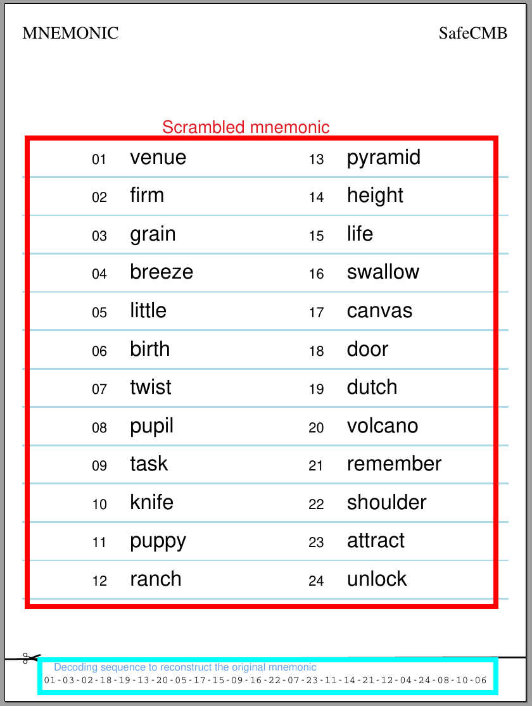

# SAFECMB

SAFECMB stands for SAFE Crypto Mnemonic Backup. It is a simple technique to improve the security of a mnemonic phrase. 

Before continuing, a word of warning: this technique is nothing more than a personal consideration related to securing mnemonic phrases, it has not been peer-reviewed or validated in any way. **USE AT YOUR OWN RISK**.

The concept of SAFECMB is to leverage the order of the mnemonic phrase to create two separate components that are:

- A scrambled mnemonic phrase
- A decoding sequence to reconstruct the correct mnemonic phrase

Given a mnemonic phrase `M`, we defined the function `SAFCMB(M)` that performs:

```
SAFECMB(M) -> (M', O)
```

where `M'` is `M` with different world order and `O` is the correct sort order to reconstruct `M` from `M'`. 

In a practical scenario, you would store `M'` and `O` in two separate places, ideally `M'` as a physical copy and `O` in a secure digital storage such as a password manager. 

The idea is that for a 24 words mnemonic there are 24! possible arrangments (permutations), that is ~6.2x10^23 arrangements, making it very difficult to guess or brute force the right combination.  

The positive aspect of this approach is that in a case where an attacker has had access to a mnemonic backup (`M'`), it will not be enough to get to the correct mnemonic (`M`) without having the correct order (`O`). 

The negative aspect is that two pieces of information need to be secured. It is also important to consider what is the actual risk of a mnemonic backup being exposed.


### Future work 
The security of the approach can be further improved by deriving a Bitcoin or Ethereum account from the `M'` mnemonic, to top it up with some small amounts and monitor its balance. If the balance changes it will indicate that the mnemonic backup has been compromised.


### Usage 

to run `safecmb` first compile the binary by running:

```
cargo build --release
```

then run 

```
./target/release/safecmb
```

the command will generate a pdf file containing your mnemonic phrase and decoding sequence as shown in the following example:



